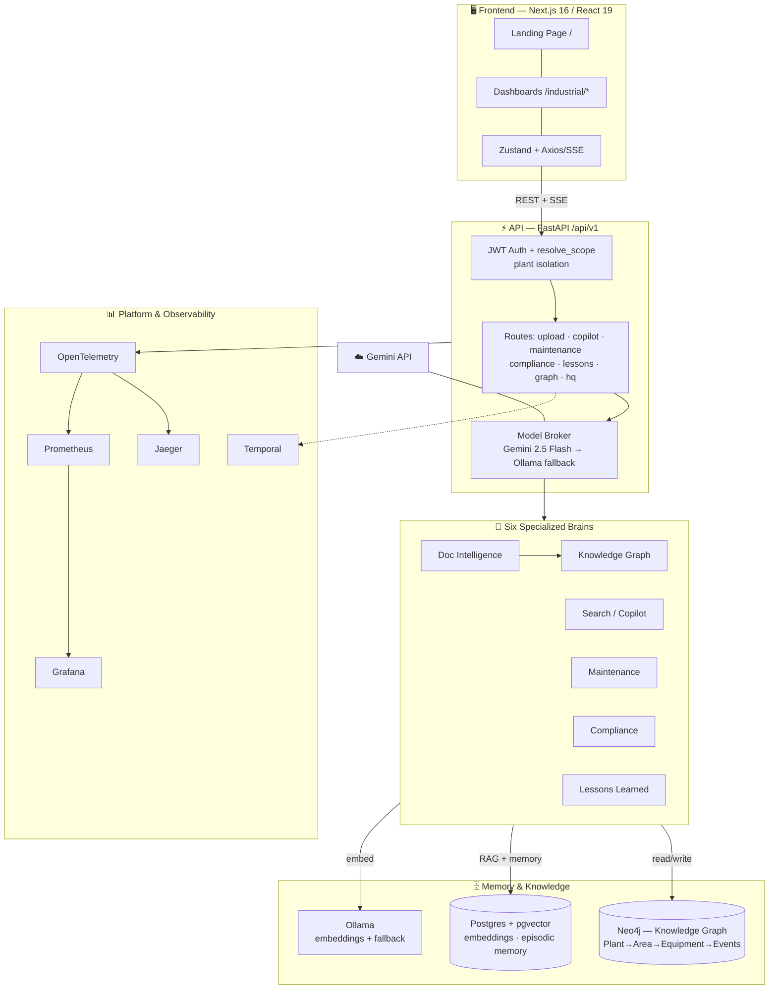

<div align="center">

# ⚙️ SureFlow OS

### The Agentic Operating System for Heavy Industry

**Downtime Down, Uptime Up.**

Operators upload their raw plant documents — OEM manuals, SOPs, incident reports, inspection records.
SureFlow turns them into a live **Knowledge Graph + semantic memory** that six specialized AI agents
reason over to deliver maintenance intelligence, compliance audits, lessons learned, and a
natural-language Copilot.

<br/>


</div>

---

## 📑 Table of Contents

| Section | |
|---|---|
| [The Problem](#-the-problem) | Why plants lose money on paper |
| [What SureFlow Does](#-what-sureflow-does) | The product in one screen |
| [Quick Start](#-quick-start) | **Running in ~5 minutes** |
| [Demo Logins](#-demo-logins) | Credentials that actually work |
| [Features](#-features) | The full inventory |
| [Architecture](#-architecture) | How the pieces fit |
| [The Six AI Brains](#-the-six-ai-brains) | The agent layer |
| [Tech Stack](#-tech-stack) | What it's built on |
| [Project Structure](#-project-structure) | Where things live |
| [Documentation](#-documentation) | The rest of the docs |

---

## 🔥 The Problem

A petrochemical plant's most valuable operational knowledge is **trapped in unstructured documents** —
thousands of PDF manuals, scanned inspection sheets, and incident write-ups nobody can query.

When a pump fails at 3 AM, the answer usually exists. It's on page 340 of a 2011 OEM manual, or in an
incident report from a sister plant that hit the same failure last year. Nobody finds it in time.

**The result:** repeat failures, missed compliance gaps, and lessons that are never actually learned.

## 💡 What SureFlow Does

SureFlow ingests those documents and builds two complementary memories:

- a **Knowledge Graph** (Neo4j) — the plant's structure: `Plant → Area → Equipment → Incidents`
- a **semantic vector store** (pgvector) — the plant's meaning: what the documents actually say

Six specialized agents reason across **both** at once. Ask *"why does P-101 keep cavitating?"* and the
Copilot walks the graph for that pump's real failure history **and** semantically searches every
manual — then answers with **citations** back to the source document.

> **The key property:** upload a document and it lands in *every* dashboard — Equipment, Maintenance,
> Compliance, Lessons Learned — not just in a chatbot's search index.

---

## 🚀 Quick Start

### Prerequisites

| Requirement | Notes |
|---|---|
| **Docker Desktop** | Runs the whole backend + all infrastructure |
| **Node.js 20+** | For the frontend |
| **Gemini API key** | Free tier is plenty — [get one here](https://aistudio.google.com/apikey) |
| **Ollama** *(optional)* | Local embeddings + offline fallback — `ollama pull nomic-embed-text` |

### 1️⃣ Configure

```bash
git clone <your-repo-url>
cd sureflow-ai

cp backend/.env.example backend/.env
```

Open `backend/.env` and set your key — this is the **only** value you must provide:

```env
GEMINI_API_KEY=your-key-here
```

### 2️⃣ Start everything

```bash
docker compose up -d
```

This brings up **all nine services**: the FastAPI backend, the Temporal worker, Postgres + pgvector,
Neo4j, Temporal, Jaeger, Prometheus, and Grafana.

Confirm it's healthy:

```bash
docker compose ps
curl http://localhost:8000/api/v1/health
# → {"status":"online","service":"SureFlow OS","version":"2.0.0"}
```

### 3️⃣ Seed the demo data

Two plants, twelve pieces of equipment, three users, and KPI history:

```bash
docker compose exec backend python scripts/seed_industrial_data.py
docker compose exec backend python scripts/seed_users.py
docker compose exec backend python scripts/seed_kpi_snapshots.py
```

### 4️⃣ Start the frontend

```bash
cd frontend
npm install
npm run dev
```

### 5️⃣ Open it

**→ [http://localhost:3000](http://localhost:3000)** and sign in with a demo account below.

> 💡 Prefer running the backend outside Docker with hot-reload? See
> **[docs/GETTING_STARTED.md](docs/GETTING_STARTED.md)**.
> Something broken? See **[docs/TROUBLESHOOTING.md](docs/TROUBLESHOOTING.md)**.

---

## 🔑 Demo Logins

| Role | Email | Password | Sees |
|---|---|---|---|
| 🌐 **CTO** *(global)* | `cto@sureflow.ai` | `Sureflow_CTO_2026!` | **All plants** + the HQ roll-up layer |
| 🏭 **Karnataka Manager** | `karnataka@sureflow.ai` | `Sureflow_Plant_2026!` | `PLANT-001` only |
| 🏭 **Delhi Manager** | `delhi@sureflow.ai` | `Sureflow_Plant_2026!` | `PLANT-002` only |

Scope is derived server-side from the verified JWT — never from a client field. Signing in as a plant
manager and requesting another plant's data returns **403**.

**Try this to see it:** log in as Karnataka, note the equipment list. Log in as the CTO and use the
**plant switcher** in the sidebar — same data, plus a cross-plant benchmark view a manager can't reach.

---

## 🌐 Service Map

| Service | URL | Purpose |
|---|---|---|
| **Frontend** | [localhost:3000](http://localhost:3000) | The app |
| **API docs** | [localhost:8000/docs](http://localhost:8000/docs) | Interactive OpenAPI — 55 routes |
| **Health** | [localhost:8000/api/v1/health](http://localhost:8000/api/v1/health) | Liveness |
| **Neo4j Browser** | [localhost:7474](http://localhost:7474) | Inspect the graph (`neo4j` / `sureflow_password`) |
| **Temporal UI** | [localhost:8085](http://localhost:8085) | Durable workflows |
| **Jaeger** | [localhost:16686](http://localhost:16686) | Distributed traces |
| **Grafana** | [localhost:3001](http://localhost:3001) | Metrics dashboards |
| **Prometheus** | [localhost:9090](http://localhost:9090) | Raw metrics |

---

## ✨ Features

### Core platform

| | Feature | What it does |
|---|---|---|
| 🏠 | **Landing + Plant Overview** | Public marketing page at `/`; the app lives at `/industrial` with live KPIs, the `Plant → Area → Equipment` tree, and recent incidents. |
| 💬 | **Industrial Copilot** | Conversational assistant doing **hybrid search** — graph traversal *plus* vector semantic search — synthesizing answers **with citations**. |
| 🔧 | **Equipment Dashboard** | Browse, search, and filter every asset; per-asset detail with an event **timeline** and live IoT sensor gauges. |
| 🛠️ | **Maintenance Intelligence** | Root Cause Analysis (5-Why), cross-asset failure **prediction** (MTBF), and prioritized preventive recommendations. |
| 📋 | **Compliance** | Regulatory **gap analysis**, SOP checks, and audit-readiness scoring (OSHA / ISO / Factory Act). |
| 🎓 | **Lessons Learned** | Extracts lessons from incidents, raises **cross-asset warnings**, detects recurring failure patterns. |
| 📤 | **Document Ingestion** | PDF/DOCX/image/text → OCR → entity extraction → embedded into pgvector **and** synced into the graph, with **live SSE progress**. |

### Multi-plant & operations

| | Feature | What it does |
|---|---|---|
| 🔐 | **Auth + RBAC** | JWT login, bcrypt hashing, three roles, complete plant-level data isolation. |
| 🏢 | **HQ layer** *(CTO)* | Cross-plant roll-up, side-by-side comparison, reliability benchmarking, and a **global Copilot** spanning all plants. |
| 🔔 | **Alerts & Digest** | Deterministic alerts from graph signals, a sidebar bell badge, and a prioritized "morning briefing" risk digest. |
| ⚙️ | **Closed-loop Work Orders** | Create a work order straight from a Maintenance recommendation, then track `open → in_progress → completed`. |
| 📊 | **KPI Trends** | Snapshot history with per-metric line charts. |
| 🔎 | **Global Search + CSV Export** | Search across equipment, incidents, documents, and lessons; export any table. |
| 🧪 | **AI Quality & Cost panel** | Per-agent confidence, latency, cost, and schema-validity tracking. |

> 📌 For the honest, complete inventory — including **what isn't built and why** — see
> **[docs/PROJECT_STATUS.md](docs/PROJECT_STATUS.md)**.

---

## 🏗 Architecture

Five layers: **Client → API → Agents → Memory → Infrastructure.**



### Key data flows

**Document upload → insight** — `POST /api/v1/industrial/upload/stream`

```
File → OCR/extract (Tesseract · pypdf · docx)
     → Doc Intelligence Agent (entities, relationships, type)
     → embed chunks into pgvector
     → MERGE Equipment + Document nodes into Neo4j (deterministic)
     → live SSE progress at every stage
```

**Copilot query** — `POST /api/v1/industrial/copilot/stream`

```
Query → detect equipment tags
      → Neo4j: graph overview + asset timeline
      → pgvector: semantic search across all collections
      → single Gemini synthesis call → cited answer
```

---

## 🧠 The Six AI Brains

Each agent lives in `backend/agents/` and emits a structured `BrainOutput` — reasoning, confidence,
risk level, citations, and a self-challenge.

| Agent | ID | Role |
|---|---|---|
| **Document Intelligence** | `DOC_INTELLIGENCE` | OCR'd text → entities, relationships, doc type, intelligent chunks |
| **Knowledge Graph** | `KG_AGENT` | Resolves and deduplicates entities, writes nodes/edges to Neo4j |
| **Search / Copilot** | `SEARCH_AGENT` | Hybrid graph + vector retrieval → cited natural-language answers |
| **Maintenance** | `MAINTENANCE` | RCA, failure prediction, preventive recommendations |
| **Compliance** | `COMPLIANCE` | Regulatory gap analysis, SOP checks, audit readiness |
| **Lessons Learned** | `LESSONS_LEARNED` | Lesson extraction, cross-asset warnings, pattern detection |

Every agent follows the same shape: **gather graph + vector context → one LLM reasoning call →
structured JSON out.** The **Model Broker** routes each call cost-aware and falls back to local
Ollama automatically if the primary model errors.

---

## 🛠 Tech Stack

<table>
<tr><td><b>Frontend</b></td><td>
Next.js 16 (App Router) · React 19 · TypeScript · Zustand · Axios (REST + SSE) · Tailwind CSS v4 · lucide-react · react-hot-toast
</td></tr>
<tr><td><b>Backend</b></td><td>
Python · FastAPI (REST + SSE) · LangChain + LangGraph · SQLAlchemy · Alembic · a cost-aware Model Broker
</td></tr>
<tr><td><b>AI / LLM</b></td><td>
Google <b>Gemini 2.5 Flash</b> (all six agents) · Ollama <code>nomic-embed-text</code> (768-dim embeddings) + <code>llama3.2</code> (offline fallback) · pgvector RAG · <code>json-repair</code> for malformed LLM JSON
</td></tr>
<tr><td><b>Data</b></td><td>
PostgreSQL 15 + pgvector (embeddings, memory, users, alerts) · Neo4j 5 (Industrial Knowledge Graph)
</td></tr>
<tr><td><b>Infra & Observability</b></td><td>
Docker Compose · Temporal (durable workflows) · OpenTelemetry → Jaeger (traces) / Prometheus + Grafana (metrics) · Tesseract + Poppler OCR
</td></tr>
</table>

### The knowledge graph ontology

```
Plant ─CONTAINS→ Area ─CONTAINS→ Equipment
Equipment ─IS_TYPE→ AssetClass       Equipment ─MANUFACTURED_BY→ OEM
Incident ─INVOLVED→ Equipment        WorkOrder ─PERFORMED_ON→ Equipment
Inspection ─INSPECTED→ Equipment     Document ─HAS_MANUAL→ Equipment
```

Every node carries a denormalized `plant_id`, so all reads filter by plant — this is what makes the
multi-tenant isolation airtight.

---

## 📁 Project Structure

```
sureflow-ai/
├── frontend/                   # Next.js 16 app
│   └── src/
│       ├── app/                # routes: / (landing), /login, /industrial/*
│       ├── components/         # landing/ · industrial/ · layout/
│       └── lib/                # api.ts (Axios+SSE) · store.ts · AuthContext.tsx
│
├── backend/                    # FastAPI app
│   ├── agents/                 # the six Brains
│   ├── api/                    # routes.py · industrial_routes.py · hq_routes.py
│   ├── core/                   # config · model_broker · memory · security · telemetry
│   ├── knowledge_graph/        # Neo4j store + schema
│   ├── rag/                    # pgvector embeddings
│   ├── models/                 # SQLAlchemy: memory · vault · auth
│   ├── workflows/              # Temporal activities & workflows
│   ├── evaluation/             # agent quality scoring
│   ├── scripts/                # seed_industrial_data · seed_users · seed_kpi_snapshots
│   └── .env.example            # ← copy to .env
│
├── docs/                       # 📚 all documentation (start at docs/README.md)
├── observability/              # Prometheus + Grafana provisioning
└── docker-compose.yml          # all nine services
```

---

## 📚 Documentation

| Doc | What's in it |
|---|---|
| **[docs/README.md](docs/README.md)** | 🗂️ Documentation index — **start here** |
| [docs/GETTING_STARTED.md](docs/GETTING_STARTED.md) | Full setup: Docker *and* local-dev paths, env config, seeding |
| [docs/TROUBLESHOOTING.md](docs/TROUBLESHOOTING.md) | Fixes for the problems you're most likely to hit |
| [docs/DEMO_SCRIPT.md](docs/DEMO_SCRIPT.md) | 🎬 An 8–10 minute guided walkthrough for presenting |
| [docs/PROJECT_STATUS.md](docs/PROJECT_STATUS.md) | What's built, what isn't, and **why** |
| [docs/MULTI_LOCATION.md](docs/MULTI_LOCATION.md) | Multi-plant architecture and the isolation model |
| [docs/ROADMAP.md](docs/ROADMAP.md) | What comes next, ranked by impact vs. effort |
| [docs/architecture/](docs/architecture/) | Deep-dive system analysis |

---

<div align="center">

**SureFlow OS** — built for the ET Gen AI 2.0 Hackathon 🏆

*Turning shelf-ware documents into operating intelligence.*

</div>
