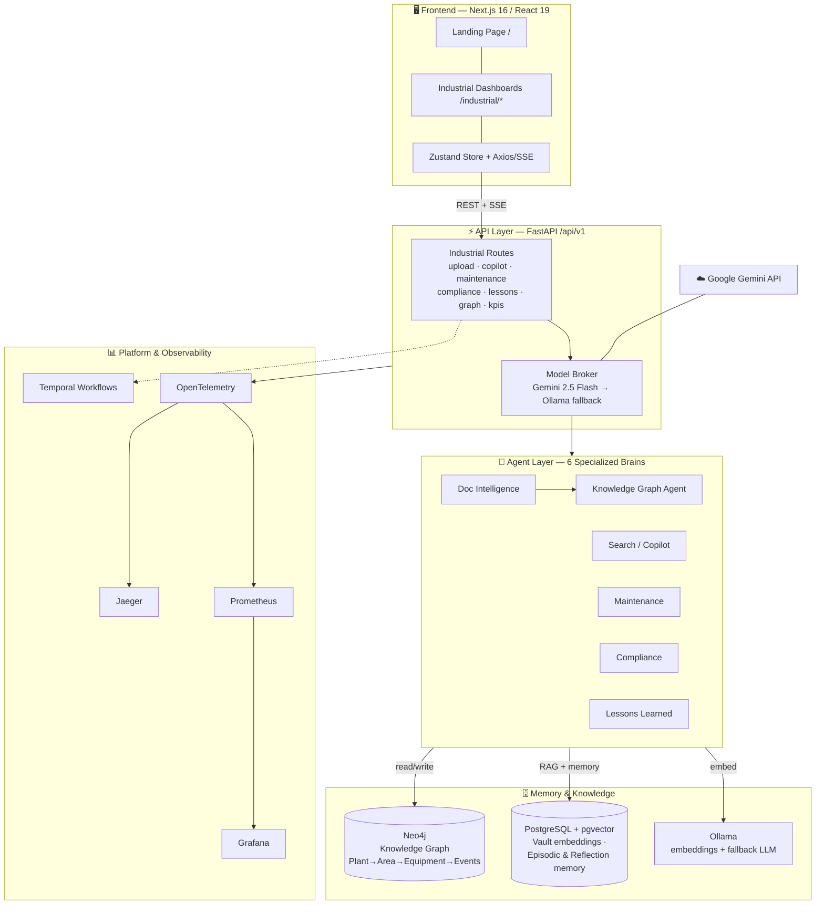

# SureFlow OS — Industrial Intelligence Platform

An agentic operations platform for heavy industry (petrochemical / process plants). Operators upload their raw documents — OEM manuals, SOPs, incident reports, inspection records — and SureFlow turns them into a live **Knowledge Graph + semantic memory** that a team of specialized AI "Brains" reason over to deliver maintenance intelligence, compliance audits, lessons learned, and a natural-language Copilot.

> **One-line pitch:** *Downtime Down, Uptime Up* — upload your plant's documents, and every dashboard gets smarter.

---

## Table of Contents
- [Features](#features)
- [Tech Stack](#tech-stack)
- [Architecture](#architecture)
- [The AI Brains (Agents)](#the-ai-brains-agents)
- [Data Stores](#data-stores)
- [Key Data Flows](#key-data-flows)
- [Project Structure](#project-structure)
- [Running Locally](#running-locally)

---

## Features

| # | Feature | What it does |
|---|---------|--------------|
| 1 | **Landing Page** | Public marketing page at `/` (the app lives at `/industrial`). |
| 2 | **Plant Overview** | Live KPIs, Plant → Area → Equipment hierarchy tree, recent incidents, knowledge-graph stats. |
| 3 | **Industrial Copilot** | Conversational assistant doing **hybrid search** (graph traversal + vector semantic search) and synthesizing answers **with citations**. |
| 4 | **Equipment Dashboard** | Browse/search/filter all assets, per-asset detail with event **timeline**, and mock **live IoT sensor** gauges. |
| 5 | **Maintenance Intelligence** | Root Cause Analysis (5-Why), cross-asset failure **prediction** (MTBF), and prioritized preventive recommendations. |
| 6 | **Compliance Dashboard** | Regulatory **gap analysis**, SOP compliance checks, and audit-readiness scoring (OSHA / ISO / Factory Act). |
| 7 | **Lessons Learned** | Extracts lessons from incidents, raises **cross-asset warnings**, and detects recurring failure patterns. |
| 8 | **Document Upload & Ingestion** | Upload PDF/DOCX/image/text → OCR → entity extraction → embed into vector store **and** sync entities into the Knowledge Graph, with **live SSE progress**. |
| 9 | **Knowledge Graph API** | Query the plant graph: hierarchy, equipment details, asset timelines, incidents, compliance gaps. |
| 10 | **Observability** | Distributed tracing, metrics, and per-call LLM cost estimation. |

---

## Tech Stack

### Frontend
- **Next.js 16** (App Router) + **React 19** + **TypeScript**
- **Zustand** (state) · **Axios** (HTTP, SSE streaming) · **Tailwind CSS v4**
- **lucide-react** (icons) · **react-hot-toast** (notifications)

### Backend
- **Python** · **FastAPI** (REST + SSE), routes under `/api/v1`
- **LangChain** + **LangGraph** — agent orchestration
- **Model Broker** — cost-aware routing with automatic fallback

### AI / LLM
- **Google Gemini 2.5 Flash** — primary reasoning model for all agents
- **Ollama** (local) — `nomic-embed-text` for embeddings; `llama3.2` as offline fallback
- **pgvector** — semantic (RAG) retrieval
- **json-repair** — hardens LLM JSON output against malformed responses

### Data Stores
- **PostgreSQL 15 + pgvector** — vector embeddings + relational memory
- **Neo4j 5** — the Industrial Knowledge Graph

### Infrastructure & Observability
- **Docker Compose** — orchestrates all services
- **Temporal** — durable workflow engine (durable ingestion pipeline)
- **OpenTelemetry** → **Jaeger** (traces), **Prometheus** (metrics), **Grafana** (dashboards)
- **OCR toolchain** — Tesseract (`pytesseract`) + Poppler (`pdf2image`) + `python-docx` + `pypdf`

---

## Architecture

Five logical layers: **Client → API → Agents → Memory/Knowledge → Infra.**



### Layer responsibilities
- **Client** — renders dashboards, streams live pipeline/agent progress over SSE.
- **API** — thin FastAPI routers; the **Model Broker** picks the model per agent and transparently falls back to local Ollama on error.
- **Agents** — six single-responsibility "Brains", each: gather graph + vector context → one LLM reasoning call → structured JSON output with confidence/risk/citations.
- **Memory & Knowledge** — the shared substrate every agent reads from and writes to (see below).
- **Infra** — durable workflows + full trace/metric/cost observability.

---

## The AI Brains (Agents)

Each agent lives in `backend/agents/` and emits a structured `BrainOutput` (reasoning, confidence, risk level, citations, self-challenge).

| Agent | ID | Role |
|-------|----|----|
| **Document Intelligence** | `DOC_INTELLIGENCE` | OCR'd text → entities, relationships, doc type, metadata, intelligent chunks. |
| **Knowledge Graph Agent** | `KG_AGENT` | Resolves/deduplicates entities and writes nodes/edges into Neo4j. |
| **Search / Copilot** | `SEARCH_AGENT` | Hybrid graph+vector retrieval → cited natural-language answers. |
| **Maintenance** | `MAINTENANCE` | RCA, failure prediction, preventive recommendations. |
| **Compliance** | `COMPLIANCE` | Regulatory gap analysis, SOP checks, audit readiness. |
| **Lessons Learned** | `LESSONS_LEARNED` | Lesson extraction, cross-asset warnings, pattern detection. |

---

## Data Stores

**Neo4j — Industrial Knowledge Graph** (ontology)
```
Plant ─CONTAINS→ Area ─CONTAINS→ Equipment
Equipment ─IS_TYPE→ AssetClass · ─MANUFACTURED_BY→ OEM
Incident ─INVOLVED→ Equipment      WorkOrder ─PERFORMED_ON→ Equipment
Inspection ─INSPECTED→ Equipment   Document ─HAS_MANUAL→ Equipment
```

**PostgreSQL + pgvector**
- `VaultDocument` — chunked document embeddings, grouped into collections (`10-oem-manuals`, `11-compliance-regs`, `12-sops`, `13-maintenance-logs`, `14-inspection-records`, `15-incident-reports`).
- `EpisodicMemory` — past agent runs ("what did I do last time?").
- `ReflectionMemory` — operational lessons learned ("what went wrong, what did we learn?").
- `Evaluation` / `Benchmark` — per-run agent quality scoring.

**Ollama** — `nomic-embed-text` (768-dim embeddings) + `llama3.2` offline fallback LLM.

---

## Key Data Flows

**Document Upload → Insight** (`POST /api/v1/industrial/upload/stream`)
```
File → OCR/extract (Tesseract/pypdf/docx)
     → Doc Intelligence Agent (entities, relationships, type)
     → Embed chunks into pgvector collection
     → Sync Equipment + Document nodes into Neo4j (deterministic MERGE)
     → live SSE progress at each stage
```
Result: an uploaded doc's equipment immediately appears in **every** dashboard dropdown (Equipment, Maintenance, Compliance, Lessons) — not just Copilot.

**Copilot Query** (`POST /api/v1/industrial/copilot/stream`)
```
Query → detect equipment tags
      → Neo4j: graph overview + asset context/timeline
      → pgvector: semantic search across all industrial collections
      → single Gemini synthesis call → cited answer
```

---

## Project Structure

```
sureflow-ai/
├── frontend/                  # Next.js 16 app
│   └── src/
│       ├── app/               # routes: / (landing), /industrial/* (app)
│       ├── components/        # landing/, industrial/, layout/
│       └── lib/               # store.ts (Zustand), api.ts (Axios/SSE)
├── backend/                   # FastAPI app
│   ├── agents/                # the 6 Brains
│   ├── api/                   # routes.py, industrial_routes.py
│   ├── core/                  # config, model_broker, memory, json_utils, telemetry
│   ├── knowledge_graph/       # Neo4j store + schema
│   ├── rag/                   # embeddings (pgvector)
│   ├── models/                # SQLAlchemy: memory.py, vault.py
│   ├── workflows/             # Temporal activities & workflows
│   ├── evaluation/            # agent scoring
│   ├── skill_registry/        # trusted skill/tool registry
│   └── scripts/               # seed_industrial_data.py
├── docker-compose.yml         # postgres, neo4j, temporal, jaeger, prometheus, grafana
└── docs/                      # design & hackathon docs
```

---

## Running Locally

```bash
# 1. Infrastructure (Postgres+pgvector, Neo4j, Temporal, observability)
docker compose up -d db neo4j

# 2. Backend  (needs a valid GEMINI_API_KEY in backend/.env)
cd backend
python -m venv .venv && .venv/Scripts/pip install -r requirements.txt
.venv/Scripts/python scripts/seed_industrial_data.py     # seed demo plant data
.venv/Scripts/python -m uvicorn main:app --reload --port 8000

# 3. Frontend
cd frontend
npm install && npm run dev        # http://localhost:3000
```

**Services:** Frontend `:3000` · API `:8000/api/v1` · Neo4j Browser `:7474` · Jaeger `:16686` · Grafana `:3001` · Temporal UI `:8085`

> **Note on the LLM:** agents use **Gemini 2.5 Flash** (`backend/core/config.py`). Embeddings and the offline fallback run on local **Ollama** (`nomic-embed-text`, `llama3.2`). Set `GEMINI_API_KEY` in `backend/.env`.
