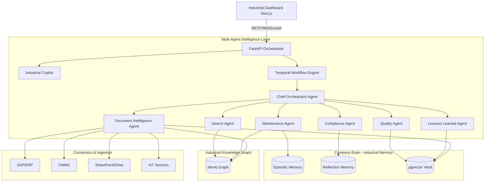

# Architecture Evolution: SureFlow Industrial Intelligence Platform

## The Core Philosophy
We are not rewriting SureFlow OS; we are specializing its cognitive operating system for the industrial sector. The system remains a Multi-Agent orchestration platform built on FastAPI, Temporal, Neo4j, and pgvector.

## High-Level Architecture

## Architectural Extensions

### 1. Document Intelligence Pipeline (Layer 0)
Currently, SureFlow OS generates its own content or reads plain text. We will introduce a new Temporal workflow specifically for Document Ingestion. When a file (PDF, P&ID) hits the `/upload` endpoint, Temporal will queue a multi-step activity:
1. **OCR / Modality Extraction**: Convert images/PDFs to structured text using LayoutLM or Tesseract.
2. **Chunking & Embedding**: Use `rag/embeddings.py` to store text in new pgvector partitions (`10-manuals`, `11-sops`).
3. **Graph Extraction**: Use the `Knowledge Graph Agent` to extract Entities (Equipment Tags, Areas) and write relationships to Neo4j.

### 2. Multi-Agent Ecosystem (Layer 1)
We will extend `core/brain.py` `BaseBrain` to create new agents in `backend/agents/`. These agents will output the standard `BrainOutput` contract, ensuring the CEO agent can orchestrate them effortlessly.

### 3. Industrial Memory (Layer 2)
The `MemoryStore` will be adapted to support new query types:
- **Reflection Memory**: Will be adapted to index factory Incidents and CAPAs (Corrective and Preventive Actions) as "Lessons Learned."
- **Semantic Memory**: Will handle large chunks of OEM manuals and safety procedures.

### 4. Knowledge Graph (Layer 3)
The current `graph_store.py` tracks Competitors and Trends. We will add new Cypher constraints and extraction methods for:
- `(Plant)-[:CONTAINS]->(Area)-[:CONTAINS]->(Equipment)`
- `(Equipment)-[:HAS_DOCUMENT]->(Manual)`
- `(Incident)-[:INVOLVED]->(Equipment)`

### 5. Copilot Interface (Layer 4)
A unified conversational interface that translates user queries, routes them to the appropriate Agent (Search, Maintenance, Compliance), aggregates the `BrainOutput`, and presents it with citations generated from the Graph and RAG stores.
